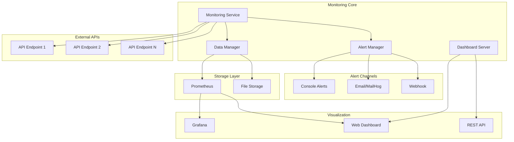
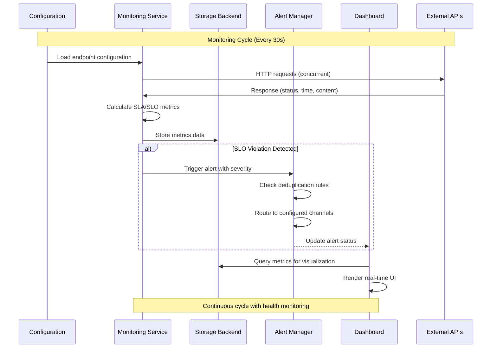
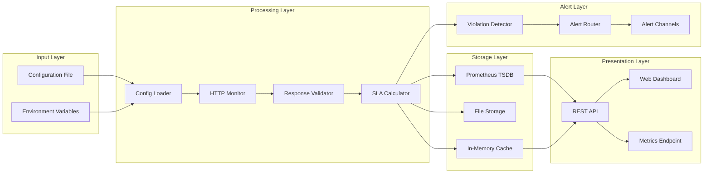

# BrightEdge API Monitoring System

A comprehensive API monitoring solution with SLA/SLO tracking, alerting, and visualization capabilities. This system monitors HTTP endpoints, tracks performance metrics, detects violations, and provides real-time alerts and dashboards.

**[📺 Demo Alert Video](https://drive.google.com/file/d/1TfJnD7lG4cWWxbwe7-V8WA-Dfbg-TlV3/view?usp=sharing)**

## 🚀 Features

### Core Monitoring
- **HTTP Endpoint Monitoring**: Configurable monitoring of API endpoints
- **Response Time Tracking**: Detailed response time metrics with percentiles
- **Content Validation**: JSON response validation and custom checks
- **Concurrent Monitoring**: Multi-threaded monitoring for improved performance
- **Configurable Intervals**: Flexible monitoring intervals and timeouts

### SLA/SLO Management
- **Availability Tracking**: Monitor endpoint availability percentages
- **Response Time SLOs**: Track average and maximum response times
- **Error Rate Monitoring**: Monitor and alert on error rate thresholds
- **Violation Detection**: Automatic SLO violation detection with severity levels

### Alerting System
- **Multiple Channels**: Console, webhook, and email alerting
- **Severity Levels**: Critical, high, medium, and low severity alerts
- **Alert Deduplication**: Prevent spam with intelligent alert management
- **Colored Console Output**: Easy-to-read console alerts with color coding

### Data Storage
- **Multiple Backends**: Prometheus and file-based storage
- **Time-Series Data**: Optimized for time-series metrics storage
- **Metrics Retention**: Configurable data retention policies
- **Fallback Storage**: Automatic fallback to file storage if primary fails

### Dashboard & Reporting
- **Web Dashboard**: Real-time web-based monitoring dashboard
- **REST API**: Complete API for integration with external tools
- **Health Status**: Overall system health monitoring
- **SLA Reports**: Automated SLA compliance reporting

## 📋 Requirements

- Python 3.8+
- Docker and Docker Compose (for containerized deployment)
- Kind + kubectl (for Kubernetes development)
- Prometheus (for time-series storage and metrics collection)
- Grafana (optional, for advanced visualization)

## 🛠️ Installation & Setup

### 🎯 Quick Deployment Options

Choose your preferred deployment method based on your needs:

| Method | Best For | Guide | Setup Time |
|--------|----------|-------|------------|
| **Docker Compose** | Local development, testing | [📖 Local Development Guide](docs/local_development.md) | 5 minutes |
| **Kind Cluster** | Kubernetes deployment | [📖 Kind Development Guide](docs/kubernetes_setup.md) | 10 minutes |
| **Production K8s** | Production environments | Production deployment section below | 30+ minutes |

### 🐳 Docker Compose (Recommended for Development)

**For complete setup instructions**: see [📖 Local Development Guide](docs/local_development.md)

```bash
# Quick start
git clone https://github.com/Shubhamhirau18/api-monitoring.git
cd api-monitoring
docker compose up -d

# Access services
open http://localhost:8080  # Monitoring Dashboard
open http://localhost:3000  # Grafana (admin/admin)
open http://localhost:9090  # Prometheus
open http://localhost:8025  # MailHog
```

### ⚓ Kind Cluster (Kubernetes Deployment)

**For complete setup instructions**: see [📖 Kind Development Guide](docs/kubernetes_setup.md)

```bash
# Prerequisites: Install Kind and kubectl
brew install kind kubectl  # macOS
# or follow guide for Linux/Windows

# One-command deployment
git clone https://github.com/Shubhamhirau18/api-monitoring.git
cd api-monitoring
./k8s/deploy.sh

# Access services (no port-forward needed!)
open http://localhost:8080  # Monitoring Dashboard
open http://localhost:3000  # Grafana
open http://localhost:9090  # Prometheus
open http://localhost:8025  # MailHog
```

### 🏭 Production Kubernetes

For production deployment with enterprise-grade security, scaling, and monitoring:

```bash
# Update images for your registry
sed -i 's|brightedge-monitoring:latest|your-registry.com/brightedge-monitoring:v1.0.0|g' k8s/monitoring-app-deployment.yaml

# Deploy to production cluster
kubectl apply -f k8s/namespace.yaml
kubectl apply -f k8s/rbac.yaml
kubectl apply -f k8s/
```

**See Production Setup section below for complete production deployment procedures.**

## 🏗️ System Architecture & Design

### 🎯 High-Level Architecture



### 📊 Data Flow Architecture



### 🔄 Component Interaction Flow



## 🛠️ Service Operation Procedures (SOP)

### 📋 Daily Operations

#### 1. Health Check Procedures
```bash
# Health Check verification steps
curl -f http://localhost:8080/api/health
curl -f http://localhost:9090/-/healthy
curl -f http://localhost:3000/api/health
```

#### 2. Monitoring Dashboard Review
- **Daily Tasks**:
  - Review system health overview
  - Check active alerts and resolve if needed
  - Verify all endpoints are monitored
  - Review SLA compliance metrics

#### 3. Alert Management
```bash
# View active alerts
curl http://localhost:8080/api/alerts

# Resolve alerts via API
curl -X POST http://localhost:8080/api/alerts/{alert_id}/resolve

# Test alert channels
python monitor.py --test-alerts
```

### 🔧 Maintenance Procedures

#### 1. Configuration Updates
```bash
# 1. Validate new configuration
python monitor.py --test-config --config new_config.yaml

# 2. Apply configuration
# For Docker:
docker compose restart monitoring

# For Kubernetes:
kubectl create configmap monitoring-config --from-file=config/monitoring_config.yaml --dry-run=client -o yaml | kubectl apply -f -
kubectl rollout restart deployment/monitoring-app -n monitoring-system
```

#### 2. System Updates
```bash
# Docker Compose
docker compose down
docker compose pull
docker compose up -d

# Kubernetes
kubectl set image deployment/monitoring-app monitoring-app=brightedge-monitoring:v1.1.0 -n monitoring-system
kubectl rollout status deployment/monitoring-app -n monitoring-system
```

#### 3. Data Backup Procedures
```bash
# Prometheus data backup
docker exec prometheus tar czf - /prometheus | gzip > prometheus-backup-$(date +%Y%m%d).tar.gz

# Configuration backup
tar czf config-backup-$(date +%Y%m%d).tar.gz config/

# Kubernetes backup
kubectl get all,configmap,secret -n monitoring-system -o yaml > k8s-backup-$(date +%Y%m%d).yaml
```

### 🚨 Incident Response Procedures

#### 1. Service Down Response
```bash
# Step 1: Check service status
kubectl get pods -n monitoring-system
docker compose ps

# Step 2: Check logs
kubectl logs -f deployment/monitoring-app -n monitoring-system
docker compose logs -f monitoring

# Step 3: Restart if needed
kubectl rollout restart deployment/monitoring-app -n monitoring-system
docker compose restart monitoring

# Step 4: Escalate if persistent
# Contact: platform-team@company.com
```

#### 2. Alert Flood Response
```bash
# Step 1: Check alert volume
curl http://localhost:8080/api/alerts | jq '. | length'

# Step 2: Identify root cause
kubectl logs -f deployment/monitoring-app -n monitoring-system --tail=100

# Step 3: Temporary alert suppression (if needed)
# Edit configuration to increase thresholds temporarily

# Step 4: Root cause analysis
# Review endpoint configurations and network connectivity
```

#### 3. Performance Degradation Response
```bash
# Step 1: Check resource usage
kubectl top pods -n monitoring-system
docker stats

# Step 2: Scale if needed (Kubernetes)
kubectl scale deployment/monitoring-app --replicas=3 -n monitoring-system

# Step 3: Check storage capacity
df -h
kubectl get pvc -n monitoring-system
```

### 📊 Monitoring Procedures

#### 1. SLA/SLO Monitoring
```bash
# Generate SLA report
curl "http://localhost:8080/api/sla?window=24" | jq .

# Check compliance
python -c "
import requests
r = requests.get('http://localhost:8080/api/sla?window=24')
data = r.json()
for endpoint in data['endpoints']:
    if endpoint['availability'] < 99.9:
        print(f'SLA BREACH: {endpoint[\"name\"]} - {endpoint[\"availability\"]}%')
"
```

#### 2. Performance Monitoring
```bash
# Monitor response times
curl http://localhost:8080/api/health | jq '.endpoints_status'

# Check metric trends
curl http://localhost:8080/metrics | grep api_response_time

# Grafana dashboard review
open http://localhost:3000/d/monitoring-dashboard
```

### 🔄 Deployment Procedures

#### 1. Rolling Deployment (Zero Downtime)
```bash
# Kubernetes rolling update
kubectl set image deployment/monitoring-app monitoring-app=brightedge-monitoring:v1.1.0 -n monitoring-system
kubectl rollout status deployment/monitoring-app -n monitoring-system

# Verify deployment
kubectl get pods -n monitoring-system
curl http://localhost:8080/api/health
```

#### 2. Rollback Procedures
```bash
# Kubernetes rollback
kubectl rollout undo deployment/monitoring-app -n monitoring-system
kubectl rollout status deployment/monitoring-app -n monitoring-system

# Docker Compose rollback
docker compose down
git checkout previous-version
docker compose up -d
```

## 🐳 Kubernetes Deployment

### 🎯 Architecture Overview

The system deploys to Kubernetes with production-grade features:

| Component | Replicas | Resources | Storage | Features |
|-----------|----------|-----------|---------|----------|
| **Monitoring App** | 2-10 (HPA) | 100m-500m CPU, 128Mi-512Mi RAM | - | Auto-scaling, Health checks |
| **Prometheus** | 1 | 200m-1000m CPU, 512Mi-2Gi RAM | 50Gi SSD | Metrics storage, HA-ready |
| **Grafana** | 1-2 | 100m-300m CPU, 128Mi-256Mi RAM | 10Gi SSD | Dashboards, HA |
| **MailHog** | 1 | 50m-100m CPU, 64Mi-128Mi RAM | - | Email testing |

### 🔐 Security Features

- **RBAC**: Minimal permissions with dedicated ServiceAccounts
- **Network Policies**: Zero-trust networking with controlled traffic flow
- **Pod Security**: Non-root containers, ReadOnlyRootFilesystem, dropped capabilities
- **Secrets Management**: Secure configuration management

### ⚡ Production Features

- **High Availability**: Pod anti-affinity, multiple replicas
- **Auto-scaling**: HPA based on CPU (70%) and Memory (80%)
- **Monitoring**: Comprehensive health checks and metrics
- **Persistent Storage**: Data retention across pod restarts

### 🚀 Deployment Options

#### Option 1: Kind Development Cluster
**Complete guide**: [📖 Kind Development Guide](docs/kubernetes_setup.md)

```bash
# One-command deployment
./k8s/deploy.sh

# Access via direct URLs (no port-forward needed)
http://localhost:8080  # Monitoring
http://localhost:3000  # Grafana  
http://localhost:9090  # Prometheus
```

#### Option 2: Production Kubernetes
```bash
# Update images for production registry
sed -i 's|brightedge-monitoring:latest|your-registry.com/brightedge-monitoring:v1.0.0|g' k8s/monitoring-app-deployment.yaml

# Deploy with production configuration
kubectl apply -f k8s/namespace.yaml
kubectl apply -f k8s/rbac.yaml
kubectl apply -f k8s/storage.yaml
kubectl apply -f k8s/
```

### 📊 Kubernetes Manifest Overview

| Manifest | Purpose | Features |
|----------|---------|----------|
| `namespace.yaml` | Isolation + Resource Quotas | CPU/Memory limits, PVC quotas |
| `rbac.yaml` | Security Permissions | Minimal RBAC, ServiceAccounts |
| `configmaps.yaml` | Application Configuration | Monitoring endpoints, Prometheus config |
| `storage.yaml` | Persistent Storage | PVCs for Prometheus + Grafana data |
| `*-deployment.yaml` | Application Deployments | HA, security contexts, health checks |
| `services.yaml` | Network Services | NodePort services for external access |
| `network-policies.yaml` | Network Security | Zero-trust networking |
| `hpa.yaml` | Auto-scaling | CPU/Memory based scaling |
| `pod-disruption-budgets.yaml` | High Availability | Ensure minimum replicas during updates |

## 📊 Usage

### Command Line Interface

```bash
# Basic monitoring
python monitor.py

# Configuration testing
python monitor.py --test-config

# Alert channel testing
python monitor.py --test-alerts

# Single monitoring cycle
python monitor.py --once

# Custom configuration file
python monitor.py --config /path/to/config.yaml

# Verbose logging
python monitor.py --verbose
```

### Web Dashboard

Access the comprehensive monitoring dashboard at:
- **Docker Compose**: http://localhost:8080
- **Kind Cluster**: http://localhost:8080
- **Production**: https://monitoring.yourcompany.com

#### **Single-Glance Overview Features**
- **🚦 Real-time System Status**: Instant health indicator with visual status badges and live updates
- **📊 Key Metrics Cards**: Availability, response time, and alert counts with dynamic progress bars
- **⚡ Live Data**: Auto-refresh every 30 seconds with manual refresh and pause controls
- **🎯 Visual Health Indicators**: Color-coded status for immediate system understanding

#### **Comprehensive Monitoring Panels**
- **📈 Endpoint Details**: Individual endpoint status with uptime percentages, response times, and request counts
- **🚨 Smart Alert Management**: View, resolve, and track recurring alerts with severity breakdown and repeat counts
- **⚙️ System Information**: Service status, configuration details, operational statistics, and health metrics
- **📅 Historical Context**: Alert duration tracking, repeat patterns, and trend indicators

#### **Interactive Controls & Actions**
- **🎮 Manual Controls**: Trigger monitoring cycles, test alert channels, toggle auto-refresh
- **✅ Alert Actions**: Resolve alerts directly from dashboard, view alert details and history
- **🔧 Quick Actions**: Export monitoring data, view SLA reports, access Prometheus metrics
- **📱 Responsive Design**: Mobile-friendly interface with adaptive layouts and touch controls

#### **Advanced Visualization**
- **📊 Progress Bars**: Visual SLA compliance and performance metric representation
- **🏷️ Status Badges**: Clear healthy vs. problematic endpoint identification
- **🌈 Severity Color Coding**: Critical (red), high (orange), medium (yellow), low (blue) classifications
- **🔔 Real-time Notifications**: Success/error notifications for all user actions

### API Endpoints

The system provides comprehensive REST API endpoints:

#### **Core Monitoring APIs**
- `GET /api/health` - Current system health status with endpoint details
- `GET /api/alerts` - Active alerts with severity and repeat information
- `GET /api/alerts/history?limit=<n>` - Alert history with pagination
- `GET /api/sla?window=<hours>` - SLA metrics and compliance reports
- `GET /api/config` - Complete monitoring configuration (safe subset)
- `GET /api/system-info` - System statistics and service status

#### **Interactive Control APIs**
- `POST /api/trigger-monitoring` - Manually trigger monitoring cycle
- `POST /api/alerts/<id>/resolve` - Resolve specific alert by ID
- `POST /api/test-alerts` - Test all configured alert channels

#### **Metrics & Integration**
- `GET /metrics` - Prometheus metrics endpoint for direct scraping

### Configuration Examples

#### Basic Endpoint Configuration
```yaml
endpoints:
  - name: "api_health"
    url: "https://api.example.com/health"
    method: "GET"
    expected_status: 200
    sla:
      availability_percentage: 99.9
      max_response_time_ms: 1000
    slo:
      max_avg_response_time_ms: 500
      max_error_rate_percentage: 0.1
```

#### Advanced Endpoint with Validation
```yaml
endpoints:
  - name: "api_users"
    url: "https://api.example.com/users"
    method: "GET"
    expected_status: 200
    headers:
      Authorization: "Bearer token"
    validation:
      content_checks:
        - type: "json_key_exists"
          key: "users"
        - type: "json_key_value"
          key: "status"
          expected: "success"
```

## 📈 Monitoring Metrics

### Key Performance Indicators

- **Availability**: Percentage of successful requests
- **Response Time**: Average, P95, P99 response times
- **Error Rate**: Percentage of failed requests
- **Throughput**: Requests per minute
- **Success Rate**: Percentage of requests meeting SLA

### SLA/SLO Definitions

- **SLA (Service Level Agreement)**: Business commitments (99.9% availability)
- **SLO (Service Level Objective)**: Technical targets (2s response time)
- **Violation Severity**: 
  - Critical: >100% over threshold
  - High: 50-100% over threshold
  - Medium: 25-50% over threshold
  - Low: <25% over threshold

## 🚨 Alert Examples

### Console Alert
```
================================================================================
🚨 ALERT: SLO Violation: response_time for httpbin_delay
================================================================================
📅 Timestamp: 2024-01-15 14:30:00
🔗 Endpoint: httpbin_delay
⚠️  Severity: HIGH
📊 Type: slo_violation
📝 Description: Average response time 3500.00ms exceeds SLO threshold of 3000ms
📈 Current Value: 3500.00
🎯 Threshold: 3000.00
📋 Violation Type: response_time
================================================================================
```

### Email Alert via MailHog
When SLO breaches occur, alerts are automatically sent via email to MailHog for testing and development. The email includes:

- **Rich HTML Formatting**: Professional email template with severity-based colors
- **Timezone Support**: Timestamps converted to Asia/Kolkata timezone
- **Detailed Information**: Alert details, violation metrics, and endpoint information
- **Multi-Recipient**: Configurable recipient list for team notifications

To view emails in MailHog:
1. Open MailHog web interface at http://localhost:8025
2. View all received emails in the inbox
3. Click on emails to see full HTML content and details
4. Use search and filtering features to find specific alerts

### Webhook Payload
```json
{
  "alert_id": "550e8400-e29b-41d4-a716-446655440000",
  "timestamp": "2024-01-15T14:30:00Z",
  "endpoint_name": "httpbin_delay",
  "alert_type": "slo_violation",
  "severity": "high",
  "title": "SLO Violation: response_time for httpbin_delay",
  "description": "Average response time 3500.00ms exceeds SLO threshold of 3000ms",
  "violation": {
    "violation_type": "response_time",
    "current_value": 3500.0,
    "threshold_value": 3000.0
  }
}
```

## 🔧 Configuration Reference

### Complete Configuration Example

```yaml
monitoring:
  interval_seconds: 30      # Monitoring frequency
  timeout_seconds: 10       # HTTP timeout
  max_workers: 5           # Concurrent monitoring threads

data_storage:
  type: "prometheus"       # Options: prometheus, file
  file:
    path: "./data"

alerting:
  enabled: true
  channels:
    - type: "console"
      enabled: true
    - type: "email"
      enabled: true
      smtp_server: "localhost"        # MailHog SMTP server
      smtp_port: 1025                # MailHog SMTP port
      username: ""                   # No auth required for MailHog
      password: ""                   # No auth required for MailHog
      from_address: "oncall@mailhog.local"
      to_addresses: ["admin@brightedge.com", "devops@brightedge.com"]
      use_tls: false                 # MailHog doesn't use TLS
      timezone: "Asia/Kolkata"       # Timezone for timestamps
    - type: "webhook"
      enabled: false
      url: "https://hooks.slack.com/webhook"

reporting:
  dashboard_port: 8080
  metrics_retention_days: 30
```

### Environment Variables

```bash
# Storage Configuration
PROMETHEUS_SCRAPE_INTERVAL=15s
PROMETHEUS_METRICS_PATH=/metrics

# Alert Configuration
SMTP_SERVER=smtp.gmail.com
SMTP_USERNAME=alerts@company.com
SMTP_PASSWORD=app-password

# Dashboard Configuration
DASHBOARD_PORT=8080
```

## 🐳 Docker Services (Alpine Linux Stack)

When using `docker compose up -d`, the following services are available:

| Service | Port | Purpose | Image |
|---------|------|---------|--------|
| **monitoring** | 8080 | Main monitoring app | Custom Alpine (Multi-stage) |
| **prometheus** | 9090 | Time-series database | prom/prometheus:v2.47.2 |
| **grafana** | 3000 | Visualization (admin/admin) | grafana/grafana:12.0.2 |
| **mailhog** | 8025 | Email testing web interface | mailhog/mailhog:v1.0.1 |

### **Access Points**
- **🖥️ Monitoring Dashboard**: http://localhost:8080 (Main application)
- **📈 Prometheus Metrics**: http://localhost:9090 (Time-series database and metrics collection)
- **📊 Grafana Dashboards**: http://localhost:3000 (Visualization - admin/admin)
- **📧 MailHog Web UI**: http://localhost:8025 (Email testing web interface)
- **📬 MailHog SMTP**: localhost:1025 (SMTP server for email alerts)
- **🔍 Monitoring Metrics**: http://localhost:8080/metrics (Prometheus metrics endpoint)

### **Development Commands**
```bash
# Health check all services
docker compose ps

# Follow logs for all services
docker compose logs -f

# Rebuild monitoring app only
docker compose up -d --build monitoring

# Scale for testing
docker compose up -d --scale monitoring=2
```

## 📊 Prometheus Metrics

The monitoring service exposes comprehensive metrics at `http://localhost:8080/metrics` for Prometheus scraping:

### **Core Metrics**
- `api_response_time_milliseconds` - Response times per endpoint
- `api_requests_total` - Total requests with status labels
- `api_availability_percentage` - Endpoint availability
- `api_error_rate_percentage` - Error rates per endpoint

### **HTTP Status Code Metrics** ✨ *Enhanced*
- `api_http_requests_total{endpoint_name, method, status_code}` - Total requests by specific status code (200, 404, 500, etc.)
- `api_http_requests_2xx_total{endpoint_name, method}` - Successful requests (2xx responses)
- `api_http_requests_4xx_total{endpoint_name, method}` - Client error requests (4xx responses)
- `api_http_requests_5xx_total{endpoint_name, method}` - Server error requests (5xx responses)
- `api_current_status_code{endpoint_name, method}` - Current HTTP status code per endpoint

### **Outage Detection Metrics** 🚨 *NEW*
- `api_endpoint_outage_status{endpoint_name}` - Endpoint outage status (0=healthy, 1=degraded, 2=outage)
- `api_consecutive_failures{endpoint_name}` - Number of consecutive failures for endpoint
- `api_outage_duration_seconds{endpoint_name}` - Current outage duration in seconds (0 if not in outage)
- `api_outage_events_total{endpoint_name, event_type}` - Total outage events counter

### **Example Metrics Output**
```prometheus
# HELP api_http_requests_total Total HTTP requests by status code
# TYPE api_http_requests_total counter
api_http_requests_total{endpoint_name="httpbin_get",method="GET",status_code="200"} 42
api_http_requests_total{endpoint_name="httpbin_error",method="GET",status_code="500"} 3

# HELP api_current_status_code Current HTTP status code for endpoint
# TYPE api_current_status_code gauge
api_current_status_code{endpoint_name="httpbin_get",method="GET"} 200
api_current_status_code{endpoint_name="httpbin_error",method="GET"} 500
```

### **Benefits**
- **Granular Error Analysis**: Distinguish between 404s, 500s, timeouts, etc.
- **Success Rate Monitoring**: Track 2xx vs 4xx vs 5xx response patterns  
- **Enhanced Grafana Dashboards**: Rich visualizations with status code breakdowns
- **Targeted Alerting**: Alert on specific error patterns (e.g., high 5xx rates)
- **Real-time Outage Detection**: Immediate identification of API endpoint unavailability 🚨
- **Service Health States**: Track healthy, degraded, and outage states for each endpoint
- **Recovery Monitoring**: Automatic detection and alerts when services come back online

## 📝 Troubleshooting

### Common Issues

1. **Configuration Errors**
   ```bash
   python monitor.py --test-config
   ```

2. **Storage Connection Issues**
   - Check Prometheus connectivity
   - Verify credentials and tokens
   - Fall back to file storage

3. **Alert Channel Issues**
   ```bash
   python monitor.py --test-alerts
   ```

4. **Port Conflicts**
   - Check if ports 8080, 3000, 9090, 8025 are available
   - Modify docker-compose.yml port mappings

5. **Kubernetes Access Issues**
   - Verify network policies allow external traffic
   - Check NodePort services are configured correctly
   - Ensure Kind port mappings are set up

### Debug Mode

```bash
# Enable verbose logging
python monitor.py --verbose

# Check application logs
tail -f monitoring.log

# Docker logs
docker compose logs -f monitoring

# Kubernetes logs
kubectl logs -f deployment/monitoring-app -n monitoring-system
```

## 🧪 Testing

### Running Tests

```bash
# Test configuration
python monitor.py --test-config

# Test alert channels
python monitor.py --test-alerts

# Single monitoring run
python monitor.py --once

# Test with verbose output
python monitor.py --once --verbose
```

### Test Endpoints

The configuration includes test endpoints:
- `httpbin.org/get` - Basic GET test
- `httpbin.org/post` - POST test with body
- `httpbin.org/delay/2` - Delayed response test
- `httpbin.org/status/500` - Error response test

To demonstrate the alert functionality:

1. Start the monitoring system:
   ```bash
   python monitor.py --verbose
   ```

2. The system will monitor the configured endpoints and show:
   - Console alerts when SLO violations occur
   - Web dashboard updates at http://localhost:8080
   - Colored console output for different alert severities

3. The `httpbin_delay` endpoint intentionally exceeds response time thresholds to demonstrate alerting.

## 📖 Documentation & Guides

### 📚 Setup Guides
- **[📖 Local Development Guide](docs/local_development.md)**: Complete Docker Compose setup for development
- **[📖 Kind Development Guide](docs/kubernetes_setup.md)**: Local Kubernetes development with Kind cluster
- **[📖 Production Setup](#production-setup)**: Enterprise Kubernetes deployment procedures

### 🛠️ Operational Guides
- **[📋 Service Operation Procedures](#service-operation-procedures-sop)**: Daily operations, maintenance, incident response
- **[🏗️ Architecture & Design](#system-architecture--design)**: System design, data flow, component interaction
- **[📊 Monitoring & Metrics](#monitoring-metrics)**: KPIs, SLA/SLO definitions, metrics collection

### 🔧 Configuration References
- **[⚙️ Configuration Reference](#configuration-reference)**: Complete configuration examples and options
- **[🐳 Docker Services](#docker-services-alpine-linux-stack)**: Container architecture and management
- **[⚓ Kubernetes Deployment](#kubernetes-deployment)**: K8s manifests, security, scaling

### 🚨 Support Resources
- **[🐛 Troubleshooting](#troubleshooting)**: Common issues and debug procedures
- **[🧪 Testing](#testing)**: Test procedures and validation
- **[📞 Getting Help](#getting-help)**: Support contacts and escalation procedures

## 🚀 Next Steps & Production Roadmap

### Immediate Next Steps
1. **Choose deployment method** from the guides above
2. **Configure monitoring endpoints** for your environment
3. **Set up alerting channels** (email, Slack, etc.)
4. **Review SLA/SLO targets** and adjust thresholds

### Production Considerations
- Adding comprehensive test suite
- Implementing authentication and authorization
- Adding more storage backends
- Enhancing security features
- Adding configuration validation